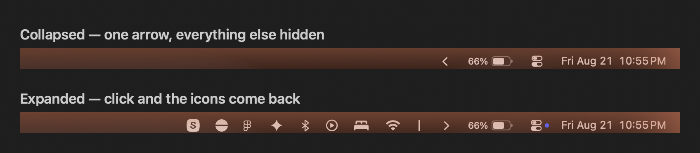
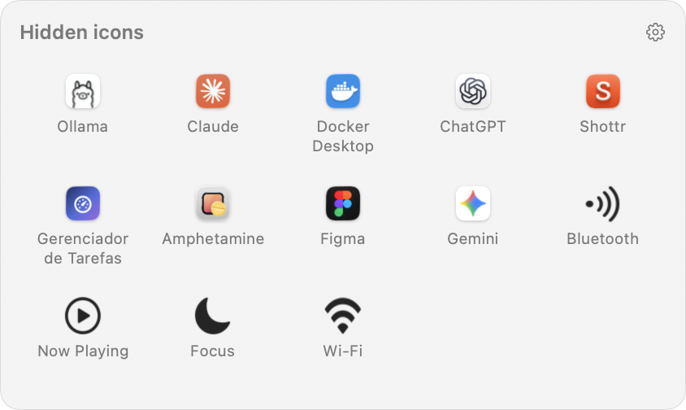

# MacTray

The Windows tray, on the macOS menu bar. One arrow collapses every status icon that
does not fit and brings them back with a click.



## Why

macOS has no overflow area for menu bar items. Once the bar is full — and on a
MacBook the notch eats most of it — new status icons are silently dropped: they are
laid out to the left of everything else, which is exactly the region the notch and the
app menus cover. Nothing warns the user; the icon simply never shows up.

## The tray

Clicking the arrow opens a panel under it with the icons that are not on the bar —
the Windows tray. Each one shows the app it belongs to; clicking it opens that app's
menu, wherever the icon actually sits.



This is what a full bar on a MacBook really needs. Expanding back onto the bar only
helps while there is room: past that, macOS lays the extra icons out under the notch,
where they are neither visible nor clickable — a synthetic click there hits nothing.
The panel does not care about that geometry.

Reading other apps' menu bar items requires the **Accessibility** permission, and only
for the panel: with it off, the arrow still collapses and expands the bar, no permission
involved. The panel asks for it the first time, and explains why before the system
dialog shows up.

Clicking an icon in the panel opens its menu in one of two ways, and one case degrades:

| Situation | What happens |
| --- | --- |
| The item accepts the accessibility press | its menu opens where the icon is, notch or not |
| It refuses, but the icon lands in the clickable part of the bar | a synthetic click on its real coordinates opens the menu |
| It refuses *and* the icon lands under the notch | MacTray brings the owning app to the front instead |

The third row is a platform limit, not a bug to fix later: a click under the notch
reaches nothing, and an app's status item cannot be moved by another app. Which apps
refuse the press is up to each app — Figma, Claude and Amphetamine accept it here,
Ollama does not.

Three implementation notes, all measured rather than assumed:

- every icon on the bar belongs to the Control Center process as far as the window
  server is concerned, so `CGWindowList` cannot tell you who owns what. The
  `AXExtrasMenuBar` attribute of each running app can;
- an item only accepts the press once the bar has laid it out, so the bar is expanded
  first and the panel waits for the icon to actually appear before acting on it. The
  accessibility element captured while the bar was collapsed goes stale across that
  relayout and has to be read again, or the press fails;
- the bar is only restored *after* the menu closes — collapsing while a menu is open
  takes its owner out of the layout and shuts the menu. `AXSelected` on the item is the
  signal for that: there is no window to observe.

## How it works

There is no public API to hide another app's status item, so MacTray occupies the
space instead. It installs its own status items and grows one of them to 10 000 points,
which pushes everything to its left off screen:

```
[always hidden] (·separator·) [hidden] (|separator|) (‹ arrow)
```

- **collapsed** — the expand separator is huge, so everything left of it disappears;
- **expanded** — the separator shrinks back to 10 points and the icons return;
- **⌥ click** — also reveals the optional always-hidden section.

Two details make the difference between working and not working on a full bar:

1. **Preferred position.** A brand new status item is born at the far left, the part
   the notch covers, so on a saturated bar the app itself is invisible. MacTray seeds
   `NSStatusItem Preferred Position <name>` (the same key the system writes when you
   ⌘-drag an icon) so its items start next to the clock. Written only once — after
   that whatever the user dragged wins.
2. **Real hiding needs real space.** Since the arrow occupies a slot, installing
   MacTray on a completely full bar pushes one existing icon out. Turning the
   separator line off in Preferences gives 10 points back.

## Install

```bash
git clone https://github.com/NspxMiguel/MacTray.git
cd MacTray
./build.sh
cp -R build/MacTray.app /Applications/
open /Applications/MacTray.app
```

Requires macOS 14 or newer. The build produces a universal binary (arm64 + x86_64)
signed ad-hoc — no Apple Developer account needed.

## Using it

- **click the arrow** — show or hide the collapsed icons;
- **⌥ click** — reveal the always-hidden section too (enable it in Preferences);
- **right click** — Preferences, About, Quit;
- **⌘ drag any menu bar icon** — this is how you decide what gets hidden: whatever
  sits to the left of the arrow collapses, whatever sits to its right stays visible.

### Preferences

| Setting | Default |
| --- | --- |
| Clicking the arrow opens the tray | on |
| Open at login | off |
| Hide when clicking anywhere else | off |
| Auto-hide after N seconds | off, 10 s |
| Always-hidden area | off |
| Arrow icon (chevron, double chevron, triangle, dot) | chevron |
| Separator line while expanded | on |
| Global keyboard shortcut | none |
| Language (automatic, Português, English) | automatic |

### Command line

The binary doubles as a controller for Shortcuts, Raycast, Keyboard Maestro or a
plain script — it talks to the running instance and exits:

```bash
/Applications/MacTray.app/Contents/MacOS/MacTray --toggle
/Applications/MacTray.app/Contents/MacOS/MacTray --show
/Applications/MacTray.app/Contents/MacOS/MacTray --hide
/Applications/MacTray.app/Contents/MacOS/MacTray --show-all
/Applications/MacTray.app/Contents/MacOS/MacTray --preferences
```

`--open <app>` opens the menu of a hidden icon by name, and `--list` prints what
MacTray is reading from the bar (useful when an icon does not show up in the panel):

```bash
/Applications/MacTray.app/Contents/MacOS/MacTray --panel
/Applications/MacTray.app/Contents/MacOS/MacTray --open Docker
/Applications/MacTray.app/Contents/MacOS/MacTray --list
```

`--login-item on|off` runs in the calling process instead of signalling the running
instance, because `SMAppService` registers the bundle of whoever calls it — that is the
path macOS opens at login:

```bash
/Applications/MacTray.app/Contents/MacOS/MacTray --login-item on
```

### Language

Portuguese and English ship in the app. The system language decides the default, the
Appearance tab overrides it, and `MACTRAY_LANG=pt` (or `en`) forces one for a single
run:

```bash
MACTRAY_LANG=pt open /Applications/MacTray.app
```

## Permissions

The tray panel needs **Accessibility** — it is the only way macOS lets an app read
other apps' menu bar items and open their menus. Nothing else does: the global
shortcut uses Carbon's `RegisterEventHotKey`, the outside-click detection uses a
global *mouse* monitor, and hiding icons is just status item geometry. No Screen
Recording at any point.

Turn the panel off in Preferences and MacTray asks for nothing at all.

## Build layout

| Path | What |
| --- | --- |
| `Sources/MacTray/TrayController.swift` | the status items and the hide/show logic |
| `Sources/MacTray/TrayPanel.swift` | the tray panel |
| `Sources/MacTray/MenuBarScanner.swift` | reads the bar through Accessibility |
| `Sources/MacTray/ItemActivator.swift` | opens a hidden icon's menu |
| `Sources/MacTray/PreferencesView.swift` | SwiftUI preferences |
| `Sources/MacTray/L10n.swift` | pt/en strings |
| `Sources/MacTray/HotKey.swift` | Carbon global shortcut |
| `Sources/MacTray/RemoteCommand.swift` | CLI ↔ running instance |
| `Tools/makeicon.swift` | draws AppIcon.icns at build time |
| `build.sh` | universal build + bundle + ad-hoc signature |

## License

MIT.
