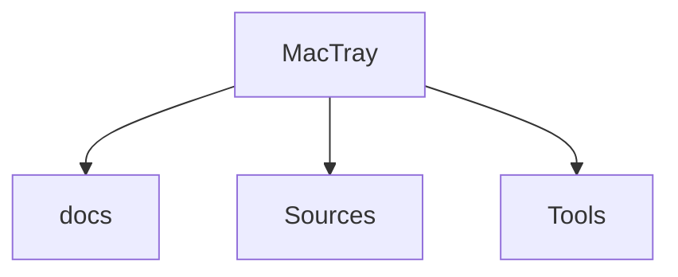

# Arquitetura — MacTray

_Documentação gerada a partir do código em 2026-08-31. Não descreve planos futuros._

## Overview

The Windows tray, on the macOS menu bar. One arrow collapses every status icon that
does not fit and brings them back with a click.

## Stack (detetada)

- Swift / Apple platforms
- Swift

## Estrutura de pastas

```
├── docs/
│   ├── index.html
│   ├── screenshot-about.png
│   ├── screenshot-bar-pt.png
│   ├── screenshot-bar.png
│   ├── screenshot-preferences.png
│   ├── screenshot-tray-pt.png
│   └── screenshot-tray.png
├── Sources/
│   └── MacTray/
├── Tools/
│   └── makeicon.swift
├── build.sh
├── LICENSE
├── Package.swift
├── PEDIDOS.md
├── README.md
├── TRABALHO.md
└── VERSION
```

## Diagrama de pastas de topo



## Documentação existente no repo

- `PEDIDOS.md`
- `README.md`
- `TRABALHO.md`

Comparar estes ficheiros com o código ao atualizar; marcar secções STALE se divergirem.

## Fluxo de desenvolvimento (genérico a partir dos artefactos)


