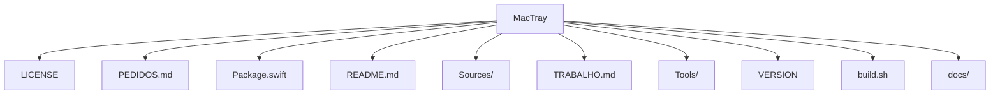

# Estrutura — MacTray

## Pastas de topo

```
MacTray/
├── LICENSE
├── PEDIDOS.md
├── Package.swift
├── README.md
├── Sources/
├── TRABALHO.md
├── Tools/
├── VERSION
├── build.sh
├── docs/
```

## Diagrama



## Componentes / módulos importantes

### `Sources/`

- `MacTray/`
